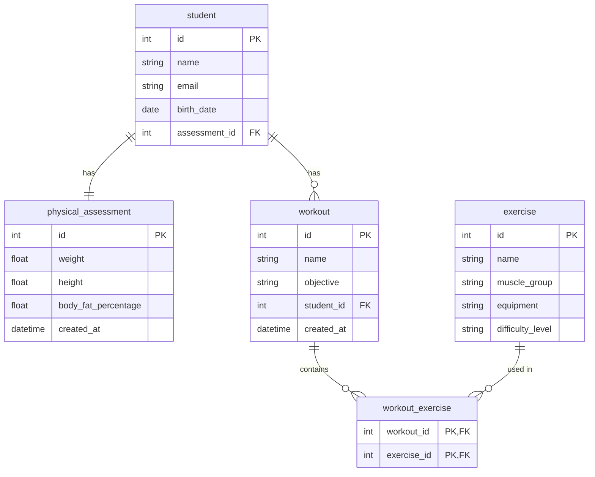

<div align="center">

# 🌱 SpringFit

*A modern REST API for managing gyms, students, and workouts with Spring Boot.*


---

📃 [About](#-about)&nbsp;&nbsp;•&nbsp;&nbsp;
🛠️ [Technologies](#-technologies)&nbsp;&nbsp;•&nbsp;&nbsp;
✨ [Features](#-features)&nbsp;&nbsp;•&nbsp;&nbsp;
🗄️ [Database Diagram](#-database-diagram)&nbsp;&nbsp;•&nbsp;&nbsp;
🚀 [Getting Started](#-getting-started)&nbsp;&nbsp;•&nbsp;&nbsp;
📖 [API Documentation](#-api-documentation)

</div>

---

## 📃 About

**SpringFit** is a REST API for gym management built with **Spring Boot** and **Spring Security**. It allows you to register students, create personalized workouts, manage exercises by muscle group, and record physical assessments. The API features **JWT** authentication, role-based access control, and interactive documentation powered by **Swagger**.

---

## 🛠️ Technologies

- ☕ **[Java 17](https://www.oracle.com/java/)** — Main programming language.
- 🌱 **[Spring Boot](https://spring.io/projects/spring-boot)** — Framework for building modern Java applications.
- 🔐 **[Spring Security](https://spring.io/projects/spring-security)** — Authentication and access control.
- 🗃️ **[Spring Data JPA](https://spring.io/projects/spring-data-jpa)** — Data access abstraction with Hibernate.
- 🐬 **[MySQL](https://www.mysql.com/)** — Relational database used in production.
- 🐳 **[Docker](https://www.docker.com/)** — Database containerization for a reproducible environment.
- 📖 **[SpringDoc OpenAPI](https://springdoc.org/)** — Interactive API documentation via Swagger UI.
- 🔑 **[JJWT](https://github.com/jwtk/jjwt)** — JWT token generation and validation.
- 🏗️ **[Lombok](https://projectlombok.org/)** — Boilerplate reduction through code generation.
- ✅ **[Bean Validation](https://beanvalidation.org/)** — Input data validation.

---

## ✨ Features

- [x] 🔐 JWT authentication (register and login)
- [x] 👥 Role-based access control (`ADMIN` and `STUDENT`)
- [x] 🎓 Student registration and removal
- [x] 🏋️ Personalized workout creation per student
- [x] 💪 Exercise management by muscle group
- [x] 📊 Physical assessment registration and retrieval
- [x] 📄 Paginated assessment listing
- [x] 🛡️ Students can only view their own physical assessment
- [x] 📖 Interactive documentation with Swagger UI

---

## 🗄️ Database Diagram



---

## 🚀 Getting Started

### 📋 Prerequisites

- ☕ [Java 17+](https://www.oracle.com/java/)
- 📦 [Maven](https://maven.apache.org/)
- 🐳 [Docker](https://www.docker.com/)

### 🔧 Installation

1. Clone the repository:

    ```bash
    git clone https://github.com/joschonarth/spring-fit.git
    ```

2. Navigate to the project folder:

    ```bash
    cd spring-fit
    ```

3. Set up environment variables in `src/main/resources/application.yml`:

    ```yaml
    datasource:
      username: ${DB_USERNAME:docker}
      password: ${DB_PASSWORD:docker}

    jwt:
      key: ${JWT_KEY:your_secret_key}
      expiration: ${JWT_EXPIRATION:900000}
    ```

    > 💡 Values after `:` are the defaults used when the environment variable is not set.

### 🐳 Database

Start the MySQL container with Docker:

```bash
docker compose up -d
```

### 🗄️ Alternative Database (H2)

If you prefer to use the in-memory **H2** database without Docker, comment out the MySQL block and uncomment the H2 block in `src/main/resources/application.yml`:

```yaml
# H2 In-Memory Database
datasource:
  url: jdbc:h2:mem:testdb
  driver-class-name: org.h2.Driver
  username: sa
  password:
h2:
  console:
    enabled: true
    path: /h2-console
```

With H2 enabled, the console will be available at **[http://localhost:8080/h2-console](http://localhost:8080/h2-console)**.

### ▶️ Running

Start the application with Maven:

```bash
./mvnw spring-boot:run
```

The API will be available at **[http://localhost:8080](http://localhost:8080)**.

---

## 📖 API Documentation

With the application running, access the interactive documentation generated by Swagger UI:

**[http://localhost:8080/swagger-ui/index.html](http://localhost:8080/swagger-ui/index.html)**

> 💡 To test protected endpoints, click **Authorize** and provide the JWT token obtained at login with the `Bearer` prefix.

---

## ⭐ Support this Project

If you liked this project, leave a ⭐ on GitHub — it means a lot!

---

<div align="center">

Made with ♥ by **[João Otávio Schonarth](https://github.com/joschonarth)**

[](https://github.com/joschonarth)
[](https://linkedin.com/in/joschonarth)
[](mailto:joschonarth@gmail.com)

</div>
