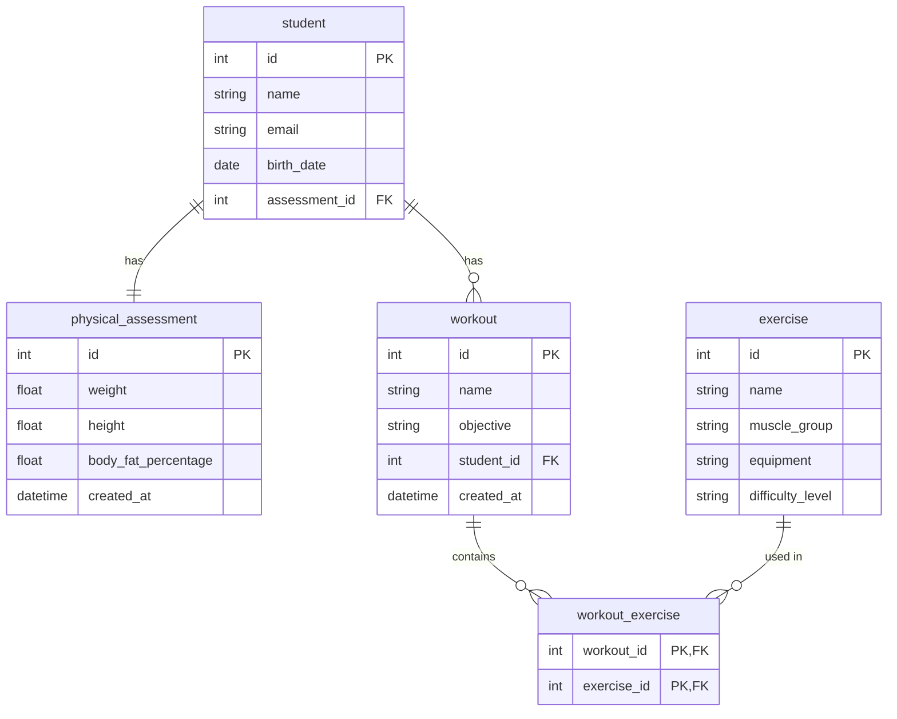

<div align="center">

# 💪 GymFlow API

*Gerencie alunos, treinos, exercícios e avaliações físicas com segurança e praticidade.*


---

📃 [Sobre](#-sobre)&nbsp;&nbsp;•&nbsp;&nbsp;
🛠️ [Tecnologias](#-tecnologias)&nbsp;&nbsp;•&nbsp;&nbsp;
✨ [Funcionalidades](#-funcionalidades)&nbsp;&nbsp;•&nbsp;&nbsp;
🗄️ [Diagrama](#-diagrama-do-banco-de-dados)&nbsp;&nbsp;•&nbsp;&nbsp;
🚀 [Como rodar](#-como-rodar)&nbsp;&nbsp;•&nbsp;&nbsp;
📖 [Documentação](#-documentação-da-api)

</div>

---

## 📃 Sobre

O **GymFlow** é uma API REST para gerenciamento de academias, construída com **Spring Boot** e **Spring Security**. Por meio dela é possível cadastrar alunos, criar treinos personalizados, gerenciar exercícios por grupo muscular e registrar avaliações físicas. A API conta com autenticação via **JWT**, controle de acesso por perfil e documentação interativa gerada pelo **Swagger**.

---

## 🛠️ Tecnologias

- ☕ **[Java 17](https://www.oracle.com/java/)** — Linguagem principal da aplicação.
- 🌱 **[Spring Boot](https://spring.io/projects/spring-boot)** — Framework para criação de aplicações Java modernas.
- 🔐 **[Spring Security](https://spring.io/projects/spring-security)** — Autenticação e controle de acesso.
- 🗃️ **[Spring Data JPA](https://spring.io/projects/spring-data-jpa)** — Abstração de acesso a dados com Hibernate.
- 🐬 **[MySQL](https://www.mysql.com/)** — Banco de dados relacional utilizado em produção.
- 🐳 **[Docker](https://www.docker.com/)** — Containerização do banco de dados para ambiente reproduzível.
- 📖 **[SpringDoc OpenAPI](https://springdoc.org/)** — Documentação interativa da API via Swagger UI.
- 🔑 **[JJWT](https://github.com/jwtk/jjwt)** — Geração e validação de tokens JWT.
- 🏗️ **[Lombok](https://projectlombok.org/)** — Redução de boilerplate com geração automática de código.
- ✅ **[Bean Validation](https://beanvalidation.org/)** — Validação de dados de entrada.

---

## ✨ Funcionalidades

- [x] 🔐 Autenticação com JWT (registro e login)
- [x] 👥 Controle de acesso por perfis (`ADMIN` e `STUDENT`)
- [x] 🎓 Cadastro e remoção de alunos
- [x] 🏋️ Criação de treinos personalizados por aluno
- [x] 💪 Gerenciamento de exercícios por grupo muscular
- [x] 📊 Registro e consulta de avaliações físicas
- [x] 📄 Listagem de avaliações com paginação
- [x] 🛡️ Alunos só visualizam sua própria avaliação física
- [x] 📖 Documentação interativa com Swagger UI

---

## 🗄️ Diagrama do Banco de Dados



---

## 🚀 Como rodar

### 📋 Pré-requisitos

- ☕ [Java 17+](https://www.oracle.com/java/)
- 📦 [Maven](https://maven.apache.org/)
- 🐳 [Docker](https://www.docker.com/)

### 🔧 Instalação

1. Clone o repositório:

    ```bash
    git clone https://github.com/joschonarth/spring-boot-essentials.git
    ```

2. Acesse a pasta do projeto:

    ```bash
    cd spring-boot-essentials
    ```

3. Configure as variáveis de ambiente no arquivo `src/main/resources/application.yml`:

```yaml
datasource:
    username: ${DB_USERNAME:docker}
    password: ${DB_PASSWORD:docker}

jwt:
    key: ${JWT_KEY:sua_chave_secreta}
    expiration: ${JWT_EXPIRATION:900000}
```

> 💡 Os valores após `:` são os padrões utilizados caso a variável de ambiente não esteja definida.

### 🐳 Banco de dados

Suba o container do MySQL com Docker:

```bash
docker compose up -d
```

### 🗄️ Banco de dados alternativo (H2)

Caso prefira utilizar o banco em memória **H2** sem precisar do Docker, basta comentar o bloco do MySQL e descomentar o bloco do H2 no arquivo `src/main/resources/application.yml`:

```yaml
# H2 In-Memory Database
datasource:
  url: jdbc:h2:mem:testdb
  driver-class-name: org.h2.Driver
  username: sa
  password:
h2:
  console:
    enabled: true
    path: /h2-console
```

Com o H2 ativo, o console estará disponível em **[http://localhost:8080/h2-console](http://localhost:8080/h2-console)**.

### ▶️ Execução

Inicie a aplicação com Maven:

```bash
./mvnw spring-boot:run
```

A API estará disponível em **[http://localhost:8080](http://localhost:8080)**.

---

## 📖 Documentação da API

Com a aplicação rodando, acesse a documentação interativa gerada pelo Swagger UI:

**[http://localhost:8080/swagger-ui/index.html](http://localhost:8080/swagger-ui/index.html)**

> 💡 Para testar endpoints protegidos, clique em **Authorize** e informe o token JWT obtido no login com o prefixo `Bearer`.

---

## ⭐ Apoie este Projeto

Se curtiu o projeto, deixe uma ⭐ aqui no GitHub — isso ajuda muito!

---

<div align="center">

Feito com ♥ por **[João Otávio Schonarth](https://github.com/joschonarth)**

[](https://github.com/joschonarth)
[](https://linkedin.com/in/joschonarth)
[](mailto:joschonarth@gmail.com)

</div>
